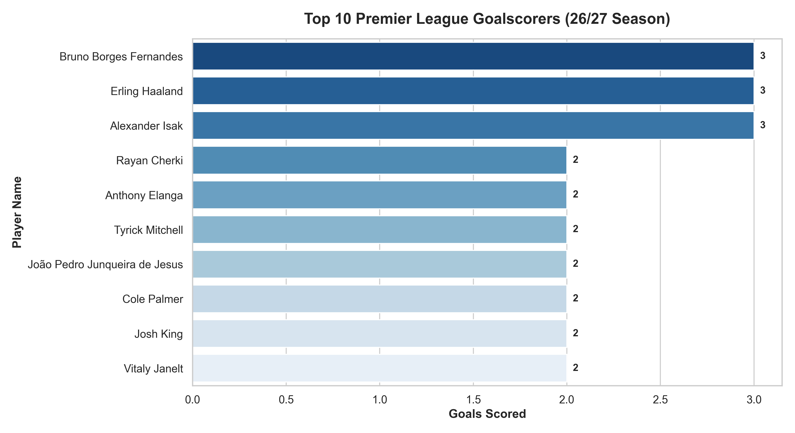

<div align="center">

# Fantasy Premier League Performance Analytics Pipeline (`fpl-analytics`)

A modular Python analytics and machine learning pipeline built to ingest, process, visualize, and model real-time player data from the Premier League. Designed with clean architecture principles to deliver data-driven insights into player performance, expected metrics ($xG$), and points prediction.

[Live Demo](https://fpremier-league-analytics.streamlit.app/) · [Report Bug](https://github.com/mhdhamka/pl-analytics/issues) · [Request Feature](https://github.com/mhdhamka/pl-analytics/issues)


</div>

---

## Overview

The **Fantasy Premier League Performance Analytics Pipeline** is an end-to-end data engineering and predictive modeling project tailored for sports analytics and Fantasy Premier League (FPL) management. 

Managing raw football data can be messy and fragmented. This project automates the entire lifecycle—from pulling live data straight off official league endpoints to structuring clean datasets, generating exploratory data visualizations, and deploying machine learning models to forecast player performance. It highlights professional software engineering standards, featuring modular design (`src/`), a master orchestration script (`main.py`), and interactive EDA notebooks.

---

## Tech Stack & Libraries

* **Language:** Python 3.x
* **Data Manipulation & Analysis:** Pandas, NumPy, Pandera (runtime schema validation)
* **Web Services & UI:** FastAPI, Uvicorn, Streamlit
* **Machine Learning:** Scikit-learn (RandomizedSearchCV, Random Forest), XGBoost
* **Data Visualization:** Seaborn, Matplotlib
* **Data Ingestion & DevOps:** Requests (Live FPL API), Pytest, Docker, GitHub Actions CI/CD

---

## Core Features & Pipeline Steps

1. **Fault-Tolerant Data Ingestion (`src/ingest.py`)**: 
   * Pulls live bootstrap data straight from official league endpoints.
   * Implements robust retry logic with **exponential backoff** to handle network hiccups gracefully.
   * Maintains a timestamped historical ledger of every fetch (`data/history/`) instead of overwriting files.

2. **Rigorous Data Wrangling & Schema Validation (`src/clean.py`)**: 
   * Programmatically executes relational mapping (merging player attributes with team and position metadata).
   * Validates raw and cleaned data frames against an explicit schema via **`pandera`** (with a dependency-free fallback if not installed).
   * Engineers advanced attributes: per-90 rate metrics, a points-per-£million value index, and one-hot encoded player positions so that **position is a real model feature** rather than ignored.

3. **Automated Visualization Engine (`src/visualize.py`)**: 
   * Programmatically generates and serializes publication-grade analytics charts with automated directory provisioning:
     * Top 10 Goalscorers Bar Chart (`outputs/figures/top_goalscorers.png`)
     * Expected Goals ($xG$) vs. Actual Goals Scatter Plot (`outputs/figures/xg_vs_actual_goals.png`)

4. **Exploratory Data Analysis (`notebooks/01_eda.ipynb`)**: 
   * Features a structured exploratory notebook containing statistical distributions, positional performance benchmarking, and feature correlation heatmaps.

5. **Optimized Predictive Modeling & Persistence (`src/model.py`)**: 
   * Benchmarks supervised regressors (**Random Forest vs. XGBoost**) utilizing **Randomized Hyperparameter Search** and rigorous 5-Fold Cross-Validation.
   * **Persists the winning pipeline to disk** alongside metadata, meaning the app and API load pre-trained models instantly rather than forcing runtime retraining on every session or request.

6. **Dual Consumption Layers (App & API)**: 
   * **Streamlit Dashboard (`app.py`)**: Interactive UI for exploring data, viewing metrics, and checking player point forecasts.
   * **FastAPI Service (`api/main.py`)**: High-performance backend providing endpoints (`/predict`, `/players`, `/model/metadata`) for external application integration.

7. **Structured Logging & Enterprise Standards**: 
   * Replaces traditional `print()` debugging with a centralized logging configuration (`src/logging_config.py`) writing cleanly formatted outputs to both the console and a **rotating log file**.

---

## Getting Started & Installation

### 1. Clone the Repository

```cmd
git clone https://github.com/mhdhamka/pl-analytics.git
cd pl-analytics

```

### 2. Install Dependencies

```cmd
pip install -r requirements.txt

pip install -r requirements-dev.txt

```

### 3. Run the Entire Pipeline

Execute the master execution script to fetch fresh data, clean it, generate updated charts, and train the machine learning model in one command:

```bash
# Option A: run against the live FPL API
python main.py

# Option B: no network / just trying it out
python scripts/generate_sample_data.py
python main.py   # will use the sample data already in data/raw/

streamlit run app.py                 # dashboard at localhost:8501
uvicorn api.main:app --reload        # API + docs at localhost:8000/docs

```
Or with Docker:

```bash
docker compose up --build
```


### 4. Run Unit Tests

To execute the test suite locally using pytest:

```bash
pip install -r requirements-dev.txt

# For Windows PowerShell:
$env:PYTHONPATH="."; pytest

# For Windows CMD:
set PYTHONPATH=. && pytest

# For Linux / macOS:
PYTHONPATH=. pytest

```

---

## What changed from the original version

This is a rebuild of an earlier, simpler version of this project. Notable
upgrades:

- **Ingestion** now retries with exponential backoff and keeps a timestamped
  history of every fetch (`data/history/`), not just a single overwritten CSV.
- **Data validation**: cleaned/raw data is checked against an explicit schema
  before it's used downstream (via `pandera`, with a dependency-free fallback
  if it isn't installed).
- **Feature engineering** now includes per-90 rate stats and a
  points-per-£million value metric, and player **position is a real model
  feature** (one-hot encoded) instead of being ignored.
- **Model training** does randomized hyperparameter search (not just
  defaults) and **persists the winning pipeline to disk** — the app and API
  load a trained model instead of retraining on every session/request.
- **Two ways to consume the model**: the Streamlit dashboard, and a FastAPI
  service (`/predict`, `/players`, `/model/metadata`) for anything else that
  wants predictions.
- **Tests, CI, Docker**: a pytest suite covering ingestion, cleaning,
  features, and modeling; a GitHub Actions workflow that lints, tests, and
  builds both Docker images; and a Dockerfile with separate targets for the
  dashboard and the API.
- **Logging** replaces `print()` throughout, writing to both console and a
  rotating log file.

---

## Model Performance Overview

* **Algorithm:** Random Forest Regressor
* **Evaluation Strategy**: 5-Fold Cross-Validation & Hold-out Test Split
* **Target Variable:** Total Points
* **Performance ($R^2$ Score):** ~0.84
* **Key Drivers:** Minutes played and goals scored hold the highest feature importances in driving overall player output.

### Sample Visualization: Top Goalscorers


---

## Project Architecture

```text
pl-analytics/
├── .github/workflows/pipeline.yml   # CI: lint, test, smoke-test, docker build
├── api/main.py                      # FastAPI service (predict, players, metadata)
├── app.py                           # Streamlit dashboard (loads the persisted model)
├── data/{raw,processed,history}     # raw="latest" snapshot, history=timestamped runs
├── models/                          # persisted model + metadata.json (gitignored)
├── notebooks/01_eda.ipynb           # exploratory analysis
├── outputs/figures/                 # generated charts (gitignored)
├── scripts/generate_sample_data.py  # synthetic data for offline dev/CI
├── src/
│   ├── config.py                    # single source of truth, env-overridable
│   ├── logging_config.py            # structured logging (console + rotating file)
│   ├── ingest.py                    # retry/backoff API fetch + versioned snapshots
│   ├── clean.py                     # merge, validate, engineer features
│   ├── features.py                  # per-90 rates, value metrics
│   ├── model.py                     # tuned RF vs XGBoost benchmark + persistence
│   └── predict.py                   # shared inference layer (app + API both use this)
├── tests/                           # pytest suite for every module above
├── Dockerfile                       # multi-target build: streamlit / api
├── docker-compose.yml
├── Makefile
└── main.py                          # orchestrates ingest -> clean -> visualize -> train
```

---

## Contributing

Issues and pull requests are welcome. If you're picking up one of the Roadmap items above, please open an issue first so effort isn't duplicated.

1. Fork the repo
2. Create a feature branch (`git checkout -b feature/real-data-integration`)
3. Commit your changes
4. Open a pull request describing what changed and why

---

## License

Distributed under the MIT License.

---

<div align="center">

If you found this project interesting, consider giving it a star ⭐

Crafted by **[@mhdhamka](https://github.com/mhdhamka)**

</div>


